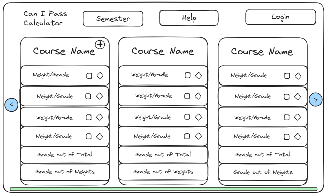
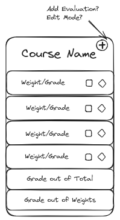
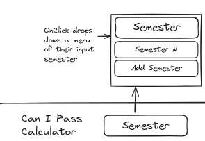
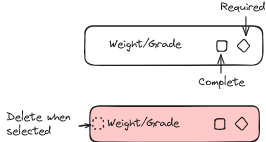

# Grade Calculator 
## Initial Plan
This is the initial layout that I am planning for the website. 
As in all development it is very likely to change. 

### Overall
Allows users to add courses and their grades/weightings to see how much
they need to pass, if they can pass or if they are out of luck.

### Course Container
Contains the individual grades and their weights. 
Allows users to add their courses' evaluations and their
grades in order to determine whether they can pass or not.
Weights should add up to 100% otherwise there is a warning.

### Semester Drop Down Menu
Allow users to swap between their semesters/course groupings and
add new semesters. 
Should also allow for deleting semesters.

### Grade and Weight
Allows the users to add their evaluation (should have a name)
and then it will calculate how many "points" their grade is worth where
points is equal to their grade percentage of the weighting.

There should also be an option to group evaluations together in the case
that they are summative and need a grade of N between them to pass.

Lowest dropped option?

